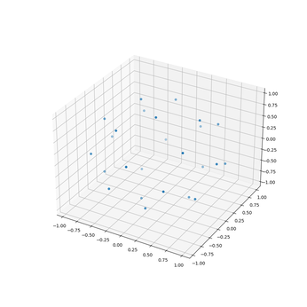

# Dokumentation

## Fische

Das verhalten der Fische wird mittels einer physikalischen Simulation berechnet, die aus 2 Komponenten besteht.

### Schwarmverhalten

Die Fische verhalten sich nach 3 einfachen Regeln

1. Kohärenz
   - Die Fische passen ihre Richtung zum Mittelpunkt aller Fische in ihrer Umgebung an. Dadurch entsteht ein Pulkartiges verhalten
2. Ausrichtung
   - Die Fische gleichen ihre Fortbewegungsrichtung den anderen Fischen in ihrer Umgebung an.
3. Separation
   - In einem deutlich kleineren Umkreis versuchen die Fische Abstand zu halten. Dazu passen sie ihre Richtung zum Durchschnitt der entgegengesetzten Verbindungsvektoren an. Die Stärke dieser Abstoßungskraft verhält sich umgekehrt quadratisch zum Abstand

Für ein besseren visuellen Effekt wurde außerdem ein unsichtbarer Anzugspunkt hinzugefügt.

Referenz:  
[1]: <https://processing.org/examples/flocking.html4>  
[2]: <https://github.com/SebLague/Boids/blob/master/Assets/Scripts/BoidCompute.compute>  

### Kollisionsvermeidung

Weiterhin vermeiden die Fische die Kollision mit der Umgebung.
Dazu wird in Bewegungsrichtung ein Strahl in die Szene geschossen und auf Schnitt mit der Szenengeometrie getestet.
Als Intersektionsalgorithmus wurde der von Möller und Trumbore verwendet.
Wird ein Schnittpunkt in geringer Distanz gefunden wird in immer größeren Winkeln zur Bewegungsrichtung Strahlen erzeugt, bis eine unversperrte Richtung gefunden wurde.
Um diese Richtungen zu erzeugen wird eine Kugeloberfläche mit äquidistanten Punkten erzeugt, diese zur Position des Fisches verschoben und die Vektoren vom Mittelpunkt zu den Punkten auf der Oberfläche als Richtungen verwendet.
Bekanntermaßen lässt sich mittels des Goldenen Schnitts nahezu gleichverteilte Punkte in der Ebene erzeugen: $f(x)=e^{i2\pi\phi \sqrt{x}}$.
Dies lässt sich auf spärische Koordinaten verallgemeinern und liefert ansatzweise äquidistante Punkte.
Wird nun eine ungehinderte Richtung gefunden wird bei geringer Distanz dich Richtung in diese angepasst und bei sehr geringer Distanz wird die Richtung direkt auf die ungehinderte Richtung gesetzt.

 

Referenzen:  
[3]: <https://www.youtube.com/watch?v=bqtqltqcQhw>  
[4]: <https://stackoverflow.com/questions/9600801/evenly-distributing-n-points-on-a-sphere/44164075#44164075>  
[5]: <https://www.youtube.com/watch?v=sj8Sg8qnjOg>  

### Technische Umsetzung

Die Simulation ist als Compute Shader implementiert. Die Szenengeometrie, die Position und Richtung der Fische und die vorher erzeugten Punkte auf der Kugel werden mittels SSBOs zur Verfügung gestellt.
Der Output Positions und Richtungs Buffer der Fische wird anschließend als instanzierter Vertex Buffer genutzt.

## Lokale Beleuchtung

Für die lokale Beleuchtung wird Blinn-Phong implmentiert.  

Referenzen:  
[6]: <https://learnopengl.com/Advanced-Lighting/Advanced-Lighting>  
[7]: Die entsprechenden Folien der Vorlesung

## Shadow Mapping

Es wurde das in der Vorlesung vorgstellte Shadow Mapping Verfahren verwendent und mittels PCF gefiltert, wobei ein besonders großer Kernel gewählt wurde.

Referenzen:  
[8]: <https://learnopengl.com/Advanced-Lighting/Shadows/Shadow-Mapping>  
[9]: Die entsprechenden Folien der Vorlesung  

## Nebel

Der Nebel ist ein Blending mit der Clear Color.
Die Implementierung ist äquivalent zum altern `glFog`.

Referenz:  
[10]: <https://wiki.delphigl.com/index.php/glFog>

## Modelle

Die Modelle wurden eigenständig mittels Blender erstellt.

## Texturen

Die Texturen wurden mittels GIMP bearbeitet.

Quellen:  
[11]: <https://www.textures.com/download/rust0217/128484?q=rust021>  
[12]: <https://www.textures.com/download/marblegranite0026/112797?q=marble+granit>  
[13]: <https://www.textures.com/download/bronzecopper0071/85733?q=scales>  
[14]: <https://www.textures.com/download/soilbeach0134/106146?q=soil+beach>  
[15]: <https://www.textures.com/download/rocksharp0092/91841?q=rock&filter=seamless>  

## Interaktivität

`CameraController` implementiert eine einfache first person Steuerung, die mittels G aktiviert wird und durch halten von ALT die Geschwindigkeit erhöht.

## Programarchitektur

Das Projekt hat bis zu dieser Finalen Version 3 rewrites erfahren. Von dem bereitgestellten Framework, über ein eigenes Framework mit ähnlicher Architektur, einem MVVM, bis schließlich zu dem hier verwendetem ECS, dass die `entt` Library verwendet.
Rückblickend hat sich erwiesen, dass dies weitgehend unnötig war.

